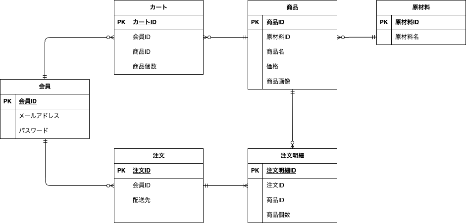

# フリマアプリ (fleamarket)

応用学習タームの成果物、個人間の商品出品・購入・管理ができる「フリマアプリ」です。

## 👥 画面定義一覧

### 🛍️ 商品・購入関連
- **商品一覧画面（トップ画面）:** `/` (おすすめ / マイリスト（いいね）の2大タブ切り替え仕様)
- **商品詳細画面:** `/item/{item_id}` (※自分の出品物の場合は「出品取り消しボタン」へ自動変身)
- **商品購入手続き画面:** `/purchase/{item_id}` (支払い方法と住所の二重防衛バリデーション搭載)
- **送付先住所変更画面:** `/purchase/address/{item_id}` (購入手続きに連動したお届け先更新)
- **商品出品画面:** `/sell` (プレースホルダーを内包した美しいドラッグ＆ドロップ風デザイン)

### 👤 マイページ・設定関連
- **プロフィール画面:** `/mypage` (出品した商品 / 購入した商品の4列折り返しグリッド仕様)
- **プロフィール編集画面:** `/mypage/profile` (角丸の赤いカスタム画像選択ボタン仕様)

### 🔐 認証・裏側処理関連
- **会員登録画面 / ログイン画面:** `/register` / `/login`
- **コメント投稿処理 / いいねトグル処理:** `/item/{item_id}/comment` / `/item/{item_id}/like`
- **出品取り消し処理（削除）:** `/item/{item_id}/delete` (DELETEメソッドによる完全安全設計)

---

## ✨ 追加機能

1. **「複数エラーの一画面同時バリデーションロジック」**
   購入手続き時、支払い方法と配送先住所の両方に不備がある場合、Laravelの標準バリデーション（Validatorファクトリ）を独自に拡張。処理を途中でせき止めず、**「選択欄の赤枠化＋その下への赤文字」と「配送先住所の下への赤文字」を一画面に同時にパッと表示させる親切なUX**を実装しました。
2. **「出品者モード（自己購入ガード）の自動出し分け」**
   マイページから自分の出品した商品を開いた際は、システムが自動的に出品者ID（`user_id`）とログインIDを照合。いいね・コメント・購入ボタンを非表示にし、代わりに**誤操作を防ぐ確認ポップアップ（confirm）付きの「出品を取り消す」ボタン**へと動的に画面を切り替えます。

---

## 🚀 環境構築手順 (Docker環境版)

手元のPC（ローカル環境）にクローンしたのち、以下の手順で実行してください。

### 1. リポジトリのクローンと移動
```bash
git clone git@github.com:yatyou/-.git fleamarket
cd fleamarket
```

### 2. Dockerコンテナの起動
※事前に Docker Desktop アプリを起動しておいてください。
```bash
docker-compose up -d
```

### 3. PHPコンテナの内部に入る
各種コマンドを実行するため、アプリが動いているサーバー（コンテナ）の中に入ります。
```bash
docker-compose exec php bash
```

---
💡 **これ以降のコマンド（手順4〜7）は、コンテナの内部（root@5c910f6a084b:/var/www#）で実行してください。**
---

### 4. ライブラリのインストール
```bash
composer install
npm install && npm run build
```

### 5. 環境設定ファイルの準備 ＆ 設定変更
```bash
cp .env.example .env
```
💡 **コピーした `.env` ファイルを開き、データベース接続設定を Docker環境（`docker-compose.yml`）に合わせて必ず以下のように修正してください。**
```env
DB_CONNECTION=mysql
DB_HOST=mysql
DB_PORT=3306
DB_DATABASE=laravel_db
DB_USERNAME=root
DB_PASSWORD=root
```
修正・保存したら、コンテナ内でアプリケーションキーを生成します。
```bash
php artisan key:generate
```

### 6. マイグレーションと指定ダミーデータの実行
データベースを完全に更地にしたのち、スプレッドシート指定の全10品（画像URL完全連動）およびテスト用出品者ユーザーを自動で一括注入します。
```bash
php artisan migrate:fresh --seed
```

### 7. 最適化キャッシュのクリア ＆ コンテナからの脱出
```bash
php artisan optimize:clear
exit
```

---

コンテナから脱出（exit）したら構築完了です！
ブラウザで `http://localhost` にアクセスして動作確認を行ってください。

## 📊 データベース設計 (ER図)
プロジェクトのルールに基づき、お名前（name）項目を引き算して最適化したプロフィール構造を反映したER図です。
ルート直下にある `fleamarket.drawio.png` を参照してください。

